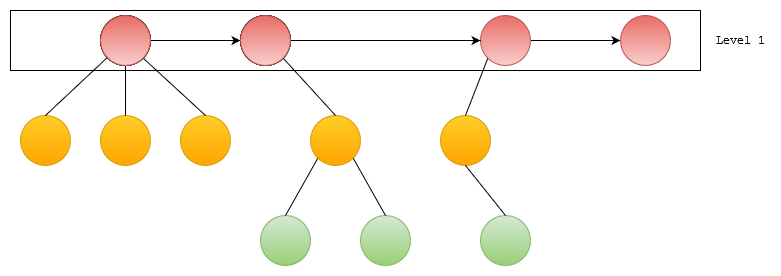
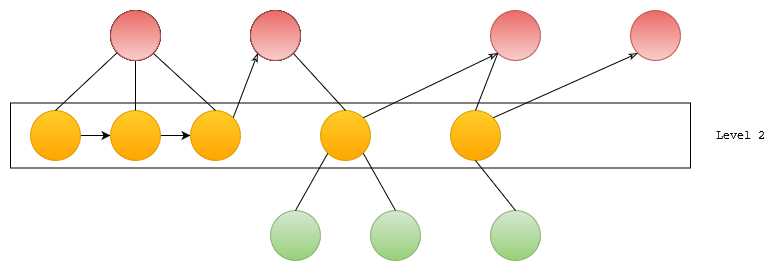
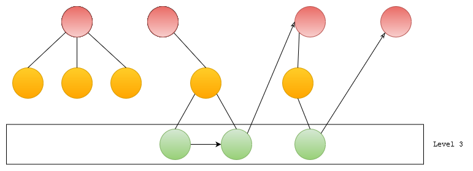

# YAPS - Yet Another PDF Splitter

Splits PDF based on Bookmarks.

## Usage

```shell
usage: main.py [-h] [-o OUTPUT_DIR] [-l LEVEL] [-v] input_file metadata

positional arguments:
  input_file            path to PDF file
  metadata              path to metadata.txt

optional arguments:
  -h, --help            show this help message and exit
  -o OUTPUT_DIR, --output_dir OUTPUT_DIR
                        directory to store split PDF's
  -l LEVEL, --level LEVEL
                        level to use to split PDF's
  -v, --verbose         print created meta tree
```

## what is metadata and how to get it

metadata is used by `main.py` to split chapters into smaller PDF's

### metadata

metadata is a simple .txt file with information regarding the bookmark data of your input PDF file

### how to get it

Using an Open source tool `pdftk` which comes with most linux distribution bundled, you can extract metadata 
of your PDF file.

```
pdftk input_file.pdf dump_data >> metadata.txt
```

## Metadata Tree Creation and Level Order Traversal

Given metadata of an PDF with chapter as bookmarks like below

```
  BookmarkBegin
  BookmarkTitle: Preface
  BookmarkLevel: 1
  BookmarkPageNumber: 17
  BookmarkBegin
  BookmarkTitle: Who This Book Is For
  BookmarkLevel: 2
  BookmarkPageNumber: 18
  BookmarkBegin
  BookmarkTitle: Who This Book Is Not For
  BookmarkLevel: 3
  BookmarkPageNumber: 18
  BookmarkBegin
  BookmarkTitle: How This Book Is Organized
  BookmarkLevel: 2
  BookmarkPageNumber: 18
```

and a level to traverse i.e : 1, 2, ...

Find chapters on that level with start page and end page numbers.

This can be solved by simply doing a pass from top to bottom and selecting level's of intrest but
we can also create a tree that represents each level and parent-child relationship (bookmarks within bookmarks).

Latter approach has been choosen, for no particular advantage in space-time complexity but based on assumption that it might allow for future enhancements with respect to selecting levels. Fork of former approach is welcome XP.

Following images illustrte bookmark metadata data as a Tree, bookmarks within bookmarks are shown as 
parent-child nodes. 

While selecting nodes from a given level last page number for that bookmark is selected from node 
indicated by arrow emerging from it.







## Chapters selected is shown if `-v` is selected

```
  |__ Contents
  |__ Preface
  |__ Chapter 1. Getting Started
  :  \
  :  |__ 1.1. Writing a Simple C++ Program
  :  |__ 1.2. A First Look at Input/Output
  :  |__ 1.3. A Word about Comments
  :  |__ 1.4. Flow of Control
  :  |__ 1.5. Introducing Classes
  :  |__ 1.6. The Bookstore Program
  :  |__ Chapter Summary
  :  |__ Defined Terms
  |__ Part I: The Basics
  :  \
  :  |__ Chapter 2. Variables and Basic Types
  :  :  \
  :  :  |__ 2.1. Primitive Built-in Types
  :  :  |__ 2.2. Variables
  :  :  |__ 2.3. Compound Types
  :  :  |__ 2.4. const Qualifier
  :  :  |__ 2.5. Dealing with Types
  :  :  |__ 2.6. Defining Our Own Data Structures
  :  :  |__ Chapter Summary
  :  :  |__ Defined Terms
  :  |__ Chapter 3. Strings, Vectors, and Arrays
  :  :  \
  :  :  |__ 3.1. Namespace using Declarations
  :  :  |__ 3.2. Library string Type
  :  :  |__ 3.3. Library vector Type
  :  :  |__ 3.4. Introducing Iterators
  :  :  |__ 3.5. Arrays
  :  :  |__ 3.6. Multidimensional Arrays
  :  :  |__ Chapter Summary
  :  :  |__ Defined Terms
```

## TODO 

- [x] document tree creation and traversal
- [x] fix page range bug
- [ ] fix chapter names with special characters
- [ ] refactor code 
- [ ] option to include metadata with split pdf's 
- [ ] progress bar for writing PDF's
- [ ] use multi- threading or processing to speed up writing pdf's
- [ ] fix output directory path handling